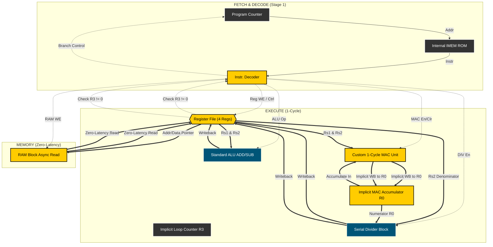

# ⚡ Bit-Trix 2026: LTI Impulse Response Accelerator


A hyper-optimized, hardware-software co-designed 8-bit CPU built for the Bit-Trix 2026 competition at IIITDM Kancheepuram. 

This repository contains the Verilog RTL, the Python-based Cocotb testbench, and the custom Assembly instruction set designed specifically to compute the impulse response sequence `h[n]` of a discrete-time LTI system in the absolute minimum number of clock cycles.

---

## 🧠 The "Secret Sauce": Bypassing the FFT Trap
The competition constraints included complex multipliers and radix-2 butterflies, tempting teams to attempt a frequency-domain deconvolution (FFT/IFFT). 

However, implementing an FFT on an 8-bit architecture with only 4 general-purpose registers guarantees catastrophic memory spilling, drastically inflating the total execution cycle count. 

**Our Solution:** We bypassed the frequency domain entirely. We designed our datapath and custom Instruction Set Architecture (ISA) to execute **Recursive Forward Substitution** in the time domain:

`h[n] = (y[n] - Σ(h[k] * x[n-k])) / x[0]`

By tailoring the hardware strictly to this formula, we achieved a **Single-Cycle Execution (CPI = 1)** core loop that destroys standard multi-cycle implementations.

---

## 🏗️ Micro-Architecture Highlights

* **Application-Specific Instruction Set (ASIP):** An 8-bit instruction word tightly packed to utilize implicit addressing.
* **Implicit MAC Accumulation:** The `MAC` instruction internally hardwires its accumulation to `R0`, bypassing the 8-bit instruction width limit that normally restricts 3-operand instructions.
* **Hardware Loop Unrolling:** Our `LOOP` instruction utilizes a dedicated hardware path to auto-decrement the loop counter (`R3`) and branch simultaneously, saving 2 software instructions per loop iteration.
* **Asynchronous Distributed RAM:** By utilizing asynchronous memory reads, our `LOAD` instructions fetch data in the same clock cycle, preventing pipeline stalls.
* **Pointer Auto-Incrementing:** Custom `LD_INC` and `LD_DEC` instructions handle memory traversal natively in hardware, eliminating pointer-arithmetic overhead.

---

## 📜 Custom ISA (Instruction Set Architecture)
Strictly constrained to 12 instructions (well below the 16-instruction limit), optimized for the DSP workload.

| Opcode | Mnemonic | Operands | Operation (RTL) | Cycles |
| :--- | :--- | :--- | :--- | :--- |
| `0000` | `NOP` | None | No operation | 1 |
| `0001` | `LD_INC` | `Rd, [Rs]` | `Rd <- RAM[Rs]; Rs <- Rs + 1` | 1 |
| `0010` | `LD_DEC` | `Rd, [Rs]` | `Rd <- RAM[Rs]; Rs <- Rs - 1` | 1 |
| `0011` | `ST_INC` | `[Rs], Rd` | `RAM[Rs] <- Rd; Rs <- Rs + 1` | 1 |
| `0100` | `MOV` | `Rd, Rs` | `Rd <- Rs` | 1 |
| `0101` | `CLR` | `Rd` | `Rd <- 0` | 1 |
| `0110` | `ADD` | `Rd, Rs` | `Rd <- Rd + Rs` | 1 |
| `0111` | `SUB` | `Rd, Rs` | `Rd <- Rd - Rs` | 1 |
| `1000` | `MAC` | `Rs1, Rs2` | `R0 <- R0 + (Rs1 * Rs2)` | 1 |
| `1001` | `DIV` | `Rd, Rs` | `Rd <- Rd / Rs` | ~ |
| `1010` | `LOOP` | `offset` | `if (R3 != 0) PC <- PC + offset; R3--` | 1 |
| `1111` | `HLT` | None | Halt execution | - |

> **Note on Overflow:** The MAC unit internally accumulates at 16-bit precision. When writing back to the 8-bit register file, it utilizes **Saturation Arithmetic**, clamping values to `127` or `-128` to gracefully handle overflow without destructive wrapping.

---

## 🚀 Running the Simulation

This project utilizes a modern verification stack: **Verilator** for strict, synthesizable RTL checking and **Cocotb** for Python-driven testbenches.

### Prerequisites
* WSL / Linux Environment
* `verilator`
* `gtkwave`
* Python 3 + `cocotb`

### Execution
1. Navigate to the testbench directory.


3. Run the makefile:
```bash
make
```
